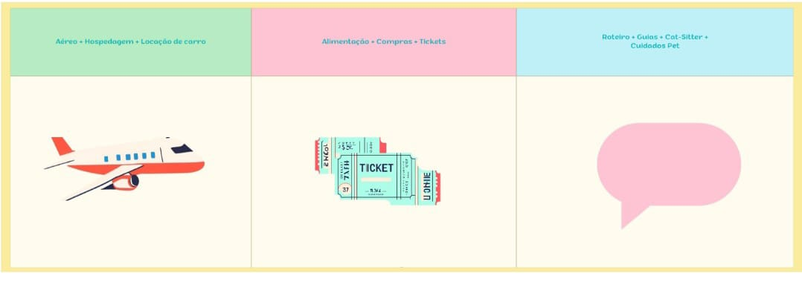
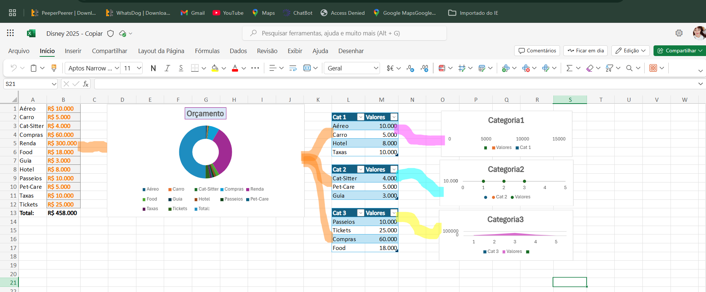

# Disney 2025 🎢🐾
## Protótipo (Canvas)
 ## Planilha (Excel) 

## Sobre  
A planilha inteligente **Disney 2025** foi criada para planejar a viagem à Disney para 4 adultos e a nossa gata Penélope. Utilizando as ferramentas do Excel, apliquei conhecimentos em organização de dados, orçamentos e criação de gráficos interativos, o que facilitou o controle de gastos e a visualização dos custos ao longo da viagem.

## O que aprendi no Excel 🧠  
Ao desenvolver a planilha, aprendi a utilizar diversas funcionalidades do Excel, como:

### 1. **Fórmulas e Funções**  
- **Funções de soma e subtração** para calcular o total das despesas em diferentes categorias (como passagens aéreas, hospedagem, alimentação, etc).
- **Fórmulas de arredondamento** para garantir que os valores finais fossem sempre apresentados de forma adequada.
- **Funções de pesquisa (PROCV)** para encontrar informações específicas dentro de grandes listas, como preços de produtos ou fornecedores.

### 2. **Formatações**  
- **formatação condicional** para destacar valores que estavam fora do orçamento ou valores que precisavam de atenção, facilitando a análise visual dos dados.
- **formatação de célula** para diferenciar as categorias (como "R$ Aéreo", "R$ Hotel", etc.) para facilitar a leitura e o entendimento.

### 3. **Gráficos Interativos**  
- **Gráficos de pizza e barras** - para visualizar os gastos planejados versus os gastos realizados, permitindo um acompanhamento dinâmico durante a viagem.
- **Gráficos interativos** - que podem ser atualizados automaticamente conforme os valores nas células mudam, otimizando o acompanhamento financeiro em tempo real.

### 4. **Tabela Dinâmica**  
- **Tabelas dinâmicas** - para organizar e sumarizar dados complexos, como a distribuição dos custos por categoria e por dia. As tabelas dinâmicas facilitaram a visualização e o ajuste de valores conforme os itens eram adicionados ou alterados.

### 5. **Validação de Dados**  
- **validação de dados** - permitindo que as células aceitassem apenas valores específicos (como números ou datas), garantindo que as informações inseridas fossem precisas.

## Objetivos da Planilha  
A planilha foi projetada para ajudar no planejamento de todos os aspectos da viagem, aplicando o que aprendi em Excel para garantir uma organização eficaz:

- **Hospedagem** pet-friendly.
- **Passagens aéreas** para 4 adultos e 1 pet.
- **Aluguel de carro** adequado para o grupo e o pet.
- **Pet-sitter** para cuidar da gata durante os passeios e compras.

## Funcionalidades da Planilha  
- **Orçamento detalhado e divididos por categorias**: Compreende despesas com passagens, hospedagem, alimentação, ingressos e outros extras, calculados automaticamente através de fórmulas e tabelas dinâmicas.

## Estrutura do Repositório
- **Protótipo**: Feito no Canvas para ilustrar a interface visual.
- **Disney2025.xlsx**: Planilha contendo todas as abas e funcionalidades descritas.
- **README.md**: Documentação explicativa sobre o projeto e as funcionalidades.

## Sobre o Projeto  
Este projeto foi desenvolvido como parte do **Bootcamp CAIXA - IA Generativa com Microsoft Copilot** pela **Digital Innovation One (DIO)**, onde apliquei e aprimorei minhas habilidades em Excel para otimizar o planejamento de viagens, utilizando técnicas de organização, análise de dados e visualização de informações.

💡 **Contribuições e sugestões são sempre bem-vindas!** 🐾✨

---
